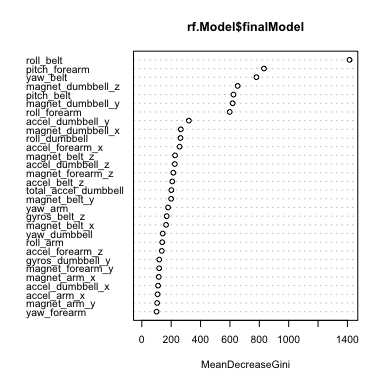

# Practical Machine Learning - Coursera - Project
rgferreira  
june, 2015  

#Executive Summary
Using devices such as Jawbone Up, Nike FuelBand, and Fitbit it is now possible to collect a large amount of data about personal activity relatively inexpensively.
There is a data set obtained from people who were asked to perform barbell lifts correctly and incorrectly in 5 different ways. 
This is a project where the request is to **design a model to train a set of regressors in order to predict the 5 possible ways of performing barbell lifts from a set of data from these users**.

The selected model has been **random forest** because of the non-linearity of the data set and the high accuracy it showed. Overfitting has been avoided as the error rates show thanks to the k-fold cross validation.

#Loading needed libraries

```r
library(caret)
library(psych)
library(gplots)
library(ggplot2)
library(RColorBrewer)
library(randomForest)
library(rmarkdown)
```

#Loading data 

```r
# Download data
trainUrl <-"https://d396qusza40orc.cloudfront.net/predmachlearn/pml-training.csv"
trainFile <- "./pml-training.csv"
if (!file.exists(trainFile)) {
        download.file(trainUrl, destfile=trainFile, method="curl")
}
testUrl <- "https://d396qusza40orc.cloudfront.net/predmachlearn/pml-testing.csv"
testFile  <- "./pml-testing.csv"
if (!file.exists(testFile)) {
        download.file(testUrl, destfile=testFile, method="curl")
}

# Cleaning data for invalid observations
trainDf <- read.csv("./pml-training.csv", na.strings=c("NA","NaN","#DIV/0!", ""))
testDf <- read.csv("./pml-testing.csv", na.strings=c("NA","NaN","#DIV/0!", ""))
```

# Cleaning data:

- Our main first data sets from the raw files are **trainDf** and **testDf**. In order to better understand the cleaning process, I show here the summary of this process and the data frames obtained:
    + trainDF ->(1)-> filteredTrainDf->(2)->**Train**
    + testDF  ->(1)-> filteredTestDf ->(2)->**Test**
- Where the **Train** data frame is divided into:
    + Train ->(3)-> 70% **training**
    + Train ->(3)-> 30% **testing**
- The cleaning processes are:
    + (1) Removing columns 1:7 (useless) and *near zero covariates*
    + (2) Removing columns with at least 80% NAs
    + (3) Data partitioning to obtaing the **testing** data frame that will enable us to calculate the accuracy and *out of sample error*.
    
## (1) Removing process

```r
# We will remove columns 1 to 7:
names(trainDf)[1:7]
```

```
## [1] "X"                    "user_name"            "raw_timestamp_part_1"
## [4] "raw_timestamp_part_2" "cvtd_timestamp"       "new_window"          
## [7] "num_window"
```

```r
# Remove:
removeVars <- grepl("^X|user|timestamp|window", names(trainDf))
trainDf <- trainDf[, !removeVars]
testDf <- testDf[, !removeVars]
# Removing zero covariates
suppressPackageStartupMessages(require(caret))
nzv <- nearZeroVar(trainDf, saveMetrics=TRUE)
nzv <- nearZeroVar(trainDf)
filteredTrainDf <- trainDf[, -nzv]
filteredTestDf <- testDf[, -nzv]
```

## (2) Removing process

```r
# Remove predictors with 80% or more missing values
Train <- filteredTrainDf[, colSums(is.na(filteredTrainDf)) <= 0.8*nrow(filteredTrainDf)] 
Test <- filteredTestDf[, colSums(is.na(filteredTestDf)) <= 0.8*nrow(filteredTestDf)] 
```

## (3) Data partitioning: Split the training set into two parts:
    + 70% for training
    + 30% for testing

```r
set.seed(22561)
inTrain <- createDataPartition(Train$classe, p=0.70, list=F)
training <- Train[inTrain,]
testing <- Train[-inTrain,] 
```

# Correlations

We obtain the correlation matrix, which by the way is not very easy to interpret due to the high number of variables. See Appendix (***Plot1***) to find the exploratory.

```r
corMatrix <- cor(training[, -53]) # Column 53 = Outcome
```

# Setting up Random Forest Model

```r
controlCV <- trainControl(method="cv")
rf.Model <- train(classe ~., data=training, method="rf", trControl=controlCV)
rf.predictions <- predict(rf.Model, testing)
```

# Results

## Accuracy
This model shows a high accuracy of more than 99%

```r
cfMatrix <- confusionMatrix(rf.predictions, testing$classe)
cfMatrix$table
```

```
##           Reference
## Prediction    A    B    C    D    E
##          A 1673    2    0    0    0
##          B    1 1135    6    0    0
##          C    0    2 1017   10    0
##          D    0    0    3  953    1
##          E    0    0    0    1 1081
```

## Out of sample error
The *out of sample* error shows to be really low.

```r
oose <- 1 - as.numeric(confusionMatrix(rf.predictions, testing$classe)$overall[1])
oose
```

```
## [1] 0.004418012
```
Please see ***Plot2*** to see how the error decrease as the trees evolve.

## ***Final result***: prediction for the main test set of 20 observations:

```r
predict(rf.Model, Test)
```

```
##  [1] B A B A A E D B A A B C B A E E A B B B
## Levels: A B C D E
```

# Other results

* System time:

```r
rf.Model$times
```

```
## $everything
##     user   system  elapsed 
## 1747.954    8.040 1755.885 
## 
## $final
##    user  system elapsed 
##  61.125   0.266  61.385 
## 
## $prediction
## [1] NA NA NA
```

# Appendix

## Error Estimation with Cross-Validation

As we may see in the following summary, this model does a **k-fold cross validation**. Precisely, the model performs **10-fold cross validation**.

```r
rf.Model
```

```
## Random Forest 
## 
## 13737 samples
##    52 predictor
##     5 classes: 'A', 'B', 'C', 'D', 'E' 
## 
## No pre-processing
## Resampling: Cross-Validated (10 fold) 
## 
## Summary of sample sizes: 12365, 12363, 12362, 12364, 12362, 12364, ... 
## 
## Resampling results across tuning parameters:
## 
##   mtry  Accuracy   Kappa      Accuracy SD  Kappa SD   
##    2    0.9918469  0.9896855  0.002053518  0.002598456
##   27    0.9923571  0.9903317  0.001914576  0.002422533
##   52    0.9851507  0.9812130  0.003396097  0.004298984
## 
## Accuracy was used to select the optimal model using  the largest value.
## The final value used for the model was mtry = 27.
```
This leads us to the following OOB (out of bag) error of 0.64%:

```r
rf.Model$finalModel
```

```
## 
## Call:
##  randomForest(x = x, y = y, mtry = param$mtry) 
##                Type of random forest: classification
##                      Number of trees: 500
## No. of variables tried at each split: 27
## 
##         OOB estimate of  error rate: 0.64%
## Confusion matrix:
##      A    B    C    D    E class.error
## A 3900    5    0    0    1 0.001536098
## B   18 2633    7    0    0 0.009405568
## C    0   16 2374    6    0 0.009181970
## D    0    0   21 2230    1 0.009769094
## E    0    1    3    9 2512 0.005148515
```


## Plots:

- **Plot1**: Correlations (Exploratory)

```r
my_palette <- colorRampPalette(c("red", "yellow", "green"))(n = 299)
col_breaks = c(seq(-1,0,length=100),  
  seq(0,0.7,length=100),             
  seq(0.7,1,length=100))          
heatmap.2(corMatrix, key = T, cexRow = 0.6, dendrogram="column", cexCol = 0.6, margins=c(9,12), density.info="none", trace="none", ColV="NA")
```

 

- **Plot2**: OOB Error progression across trees

```r
plot(rf.Model$finalModel)
```

 

- **Plot3**: Importance of predictors

```r
varImpPlot(rf.Model$finalModel,cex=0.65, col ="black", type=2)
```

 

- **Plot4**: Other parameters

```r
plot(rf.Model$results, cex=1.5)
```

 

